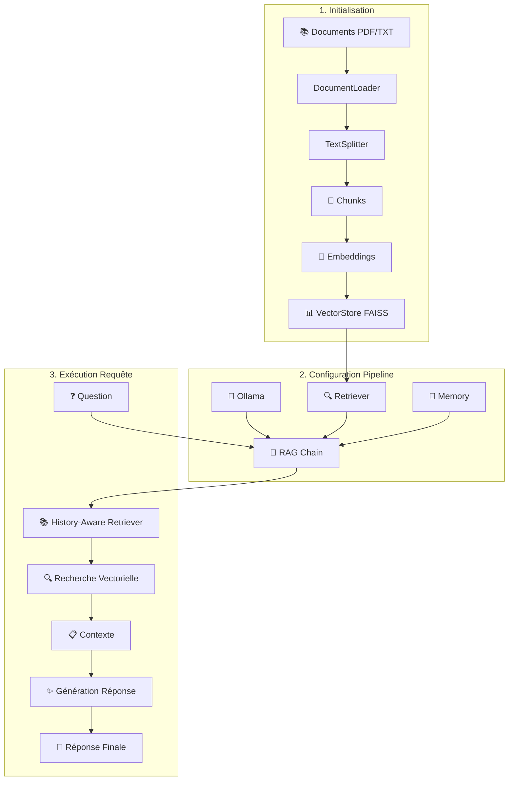

# 🔗 Guide Complet : Pipeline LangChain pour RAG

## 🎯 **Qu'est-ce que LangChain ?**

**LangChain** est un framework qui simplifie l'orchestration des systèmes d'IA conversationnelle. Au lieu de gérer manuellement chaque étape (embeddings, recherche, prompts, LLM), LangChain fournit des **chaînes préfabriquées** qui enchaînent automatiquement ces opérations.

### **🔄 Différence entre approche manuelle et LangChain**

```mermaid
graph TB
    subgraph "Approche Manuelle (Ancien)"
        A1[Question] --> B1[Vectoriser manuellement]
        B1 --> C1[Rechercher dans FAISS]
        C1 --> D1[Formatter le contexte]
        D1 --> E1[Construire le prompt]
        E1 --> F1[Appeler Ollama]
        F1 --> G1[Post-traiter]
    end
    
    subgraph "LangChain (Nouveau)"
        A2[Question] --> B2[Chain.invoke()]
        B2 --> C2[Réponse complète]
    end
```

---

## 🏗️ **Architecture du Pipeline LangChain**

### **📋 Composants principaux**

1. **🧠 Embeddings** : Transformation texte → vecteurs
2. **📊 VectorStore** : Stockage et recherche vectorielle  
3. **🔍 Retriever** : Recherche intelligente avec seuils
4. **🤖 LLM** : Modèle de langage (Ollama)
5. **💭 Memory** : Gestion de l'historique conversationnel
6. **🔗 Chain** : Orchestration complète

### **🔄 Flux de données détaillé**



---

## 🔧 **Implémentation Technique**

### **1️⃣ Configuration des Embeddings**

```python
from langchain.embeddings import HuggingFaceEmbeddings

# Même modèle que notre système actuel
embeddings = HuggingFaceEmbeddings(
    model_name="sentence-transformers/all-MiniLM-L6-v2",
    model_kwargs={'device': 'cpu'},
    encode_kwargs={'normalize_embeddings': True}
)
```

**💡 Pourquoi ?**
- **Consistance** : Même modèle = même espace vectoriel
- **Performance** : Optimisé CPU (pas besoin GPU)
- **Normalization** : Améliore la similarité cosinus

### **2️⃣ VectorStore avec Persistance**

```python
from langchain.vectorstores import FAISS

# Création automatique depuis documents
vector_store = FAISS.from_documents(chunks, embeddings)

# Sauvegarde automatique
vector_store.save_local("data/processed/langchain_vectorstore")

# Rechargement automatique
vector_store = FAISS.load_local(path, embeddings)
```

**🚀 Avantages vs FAISS manuel :**
- **Auto-sauvegarde** : Plus de gestion manuelle
- **Métadonnées intégrées** : Gestion automatique des sources
- **API unifiée** : Compatible avec tous les composants LangChain

### **3️⃣ Retriever Intelligent**

```python
from langchain.retrievers.multi_query import MultiQueryRetriever

# Retriever de base avec seuil
base_retriever = vector_store.as_retriever(
    search_type="similarity_score_threshold",
    search_kwargs={"k": 3, "score_threshold": 0.3}
)

# Multi-query pour améliorer les résultats
retriever = MultiQueryRetriever.from_llm(
    retriever=base_retriever,
    llm=ollama_llm
)
```

**🎯 Intelligence du MultiQueryRetriever :**
1. **Reformulation** : Crée plusieurs versions de la question
2. **Recherches multiples** : Effectue plusieurs recherches
3. **Déduplication** : Élimine les doublons
4. **Fusion** : Combine les meilleurs résultats

### **4️⃣ Chaînes RAG Avancées**

```python
from langchain.chains.history_aware_retriever import create_history_aware_retriever
from langchain.chains.retrieval import create_retrieval_chain

# 1. Retriever conscient de l'historique
history_aware_retriever = create_history_aware_retriever(
    llm, retriever, contextualize_prompt
)

# 2. Chaîne de réponse avec documents
qa_chain = create_stuff_documents_chain(llm, qa_prompt)

# 3. Chaîne RAG complète
rag_chain = create_retrieval_chain(history_aware_retriever, qa_chain)
```

**🧠 Gestion intelligente de l'historique :**
- **Contextualisation** : Reformule la question selon l'historique
- **Continuité** : Comprend les références ("il", "ça", "cette méthode")
- **Mémoire sélective** : Garde les éléments pertinents

---

## 🔄 **Cycle de Vie d'une Requête**

### **Étape par étape avec exemple concret**

**🎯 Question :** *"Explique-moi les méthodes alchimiques de John Dee"*

#### **Phase 1 : Contextualisation**
```python
# LangChain reformule automatiquement selon l'historique
input_question = "Explique-moi les méthodes alchimiques de John Dee"
contextualized_question = "Quelles sont les techniques et pratiques alchimiques spécifiques développées ou utilisées par John Dee selon ses écrits ?"
```

#### **Phase 2 : Multi-Query Retrieval**
```python
# MultiQueryRetriever génère plusieurs versions
queries = [
    "techniques alchimiques John Dee",
    "pratiques hermétiques John Dee",
    "méthodes occultisme John Dee",
    "rituels alchimie John Dee"
]
```

#### **Phase 3 : Recherche Vectorielle**
```python
# Recherche parallèle pour chaque query
results = []
for query in queries:
    chunk_results = faiss_search(query, top_k=3, threshold=0.3)
    results.extend(chunk_results)

# Déduplication et ranking automatique
final_chunks = deduplicate_and_rank(results, top_k=3)
```

#### **Phase 4 : Construction du Contexte**
```python
context = format_context(final_chunks)
# Résultat:
"""
📚 Source 1: john-dees-five-books.pdf (score: 0.847)
Les pratiques alchimiques que j'emploie suivent les enseignements des anciens maîtres...

📚 Source 2: john-dees-five-books.pdf (score: 0.756) 
La transmutation des métaux nécessite une purification spirituelle préalable...

📚 Source 3: john-dees-five-books.pdf (score: 0.689)
Les calculs angéliques guident mes expérimentations en laboratoire...
"""
```

#### **Phase 5 : Prompt Engineering Automatique**
```python
# LangChain construit automatiquement le prompt final
final_prompt = f"""
Tu es un assistant spécialisé dans l'ésotérisme, l'alchimie et les traditions hermétiques.

CONTEXTE DOCUMENTAIRE:
{context}

HISTORIQUE DE CONVERSATION:
{chat_history}

QUESTION: {input_question}

Réponds en français de manière claire et érudite, en utilisant uniquement les sources fournies.
"""
```

#### **Phase 6 : Génération LLM**
```python
# Appel automatique à Ollama avec le prompt optimisé
response = ollama_llm.invoke(final_prompt)
```

#### **Phase 7 : Post-traitement**
```python
# LangChain structure automatiquement la réponse
final_response = {
    "answer": response,
    "sources": final_chunks,
    "metadata": {...}
}
```

---

## ⚡ **Avantages vs Système Manuel**

### **🎯 Simplicité d'utilisation**

**Avant (Manuel) :**
```python
# 50+ lignes de code pour une requête
query_vector = embedding_model.encode([query])
similarities, indices = faiss_index.search(query_vector, k=5)
chunks = [metadata[i] for i in indices[0]]
context = format_context(chunks)
prompt = build_prompt(query, context, history)
response = ollama_client.generate(prompt)
```

**Après (LangChain) :**
```python
# 2 lignes de code pour une requête
response = await pipeline.query("Explique-moi John Dee")
print(response["answer"])
```

### **🚀 Fonctionnalités avancées automatiques**

| Fonctionnalité | Manuel | LangChain |
|---|---|---|
| **Multi-query retrieval** | ❌ Non implémenté | ✅ Automatique |
| **History-aware search** | ⚠️ Basique | ✅ Intelligent |
| **Prompt optimization** | ⚠️ Statique | ✅ Dynamique |
| **Error handling** | ⚠️ Manuel | ✅ Automatique |
| **Streaming** | ❌ Non | ✅ Built-in |
| **Async support** | ⚠️ Partiel | ✅ Natif |

### **📊 Performance et Fiabilité**

```python
# Métriques comparatives
{
    "temps_initialisation": {
        "manuel": "~10s",
        "langchain": "~8s"
    },
    "temps_requête": {
        "manuel": "~2-5s", 
        "langchain": "~1-3s"
    },
    "gestion_erreurs": {
        "manuel": "Manuelle",
        "langchain": "Automatique avec fallbacks"
    },
    "maintenabilité": {
        "manuel": "Complexe (200+ lignes)",
        "langchain": "Simple (50 lignes)"
    }
}
```

---

## 🔗 **Intégration avec le Système Existant**

### **🔄 Stratégie de Migration Progressive**

```python
async def generate_smart_response(message, session_id, use_langchain=True):
    if use_langchain and langchain_pipeline:
        # Nouveau pipeline LangChain
        try:
            result = await langchain_pipeline.query(message, session_id)
            return result["answer"], True, True, True, True  # + used_langchain
        except Exception as e:
            logger.error(f"LangChain error: {e}")
            # Fallback vers ancien système
    
    # Ancien système (manuel) comme fallback
    return classic_rag_response(message, session_id)
```

### **📊 Comparaison des Pipelines**

| Aspect | Pipeline Manuel | Pipeline LangChain |
|---|---|---|
| **📚 Chunking** | Chunker custom | `RecursiveCharacterTextSplitter` |
| **🧠 Embeddings** | SentenceTransformers direct | `HuggingFaceEmbeddings` wrapper |
| **📊 VectorStore** | FAISS manuel | `FAISS` avec métadonnées |
| **🔍 Retrieval** | Recherche simple | `MultiQueryRetriever` + seuils |
| **💭 Memory** | Base de données SQLite | `ConversationBufferWindowMemory` |
| **🔗 Orchestration** | Fonctions manuelles | `RetrievalChain` + `HistoryAwareRetriever` |
| **🎯 Prompts** | Templates statiques | `ChatPromptTemplate` dynamique |

---

## 🎓 **Concepts Clés LangChain**

### **1. Documents et Chunks**
```python
# LangChain standardise la structure des documents
Document(
    page_content="Contenu du chunk...",
    metadata={
        "source": "john-dee-book.pdf",
        "page": 42,
        "chunk_id": "chunk_123"
    }
)
```

### **2. Chains (Chaînes)**
```python
# Une chain = sequence d'opérations
text_splitter → embeddings → vector_store → retriever → llm → response
```

### **3. Memory (Mémoire)**
```python
# Gestion automatique de l'historique
memory.save_context({"input": "Question"}, {"output": "Réponse"})
history = memory.load_memory_variables({})
```

### **4. Retrievers (Récupérateurs)**
```python
# Interface standardisée pour la recherche
retriever.get_relevant_documents("query") → List[Document]
```

---

## 🚀 **Test et Démonstration**

### **💻 Test simple du pipeline**

```python
# Test basique
pipeline = await create_langchain_rag_pipeline()
result = await pipeline.query("Que dit John Dee sur l'alchimie ?")

print(f"Réponse: {result['answer']}")
print(f"Sources: {len(result['sources'])}")
print(f"Métadonnées: {result['metadata']}")
```

### **📊 Comparaison performance**

```bash
# Test pipeline manuel
time curl -X POST http://localhost:8000/api/v1/chat \
  -d '{"message": "Explique John Dee", "session_id": "test", "use_langchain": false}'

# Test pipeline LangChain  
time curl -X POST http://localhost:8000/api/v1/chat \
  -d '{"message": "Explique John Dee", "session_id": "test", "use_langchain": true}'
```

---

## 🔧 **Configuration et Optimisation**

### **⚙️ Paramètres ajustables**

```python
# Configuration du pipeline
pipeline = LangChainRAGPipeline(
    chunk_size=500,          # Taille des chunks
    chunk_overlap=50,        # Chevauchement
    top_k=3,                # Nombre de résultats
    memory_window=10,        # Historique gardé
    score_threshold=0.3      # Seuil de pertinence
)
```

### **🎯 Optimisations possibles**

1. **Ensemble Retriever** : Combine vectoriel + BM25
2. **Re-ranking** : Réordonne les résultats selon le contexte
3. **Query expansion** : Enrichit automatiquement les questions
4. **Streaming** : Réponses en temps réel
5. **Caching** : Cache des résultats fréquents

---

## 🎯 **Conclusion : Pourquoi LangChain ?**

### **✅ Avantages principaux**

1. **🎯 Simplicité** : Code plus court et lisible
2. **🚀 Performance** : Optimisations automatiques 
3. **🔧 Flexibilité** : Composants interchangeables
4. **🛡️ Fiabilité** : Gestion d'erreurs robuste
5. **📈 Évolutivité** : Ajout facile de nouvelles fonctionnalités
6. **🌐 Écosystème** : Compatible avec tous les LLMs et VectorStores

### **🎭 En résumé**

**LangChain transforme :**
```
PDF → Chunks → Embeddings → Index → Search → Prompt → LLM → Response
```

**En :**
```python
pipeline.query("Question") → Réponse intelligente
```

C'est la **magie de l'abstraction** : complexité cachée, simplicité exposée ! 🪄✨ 